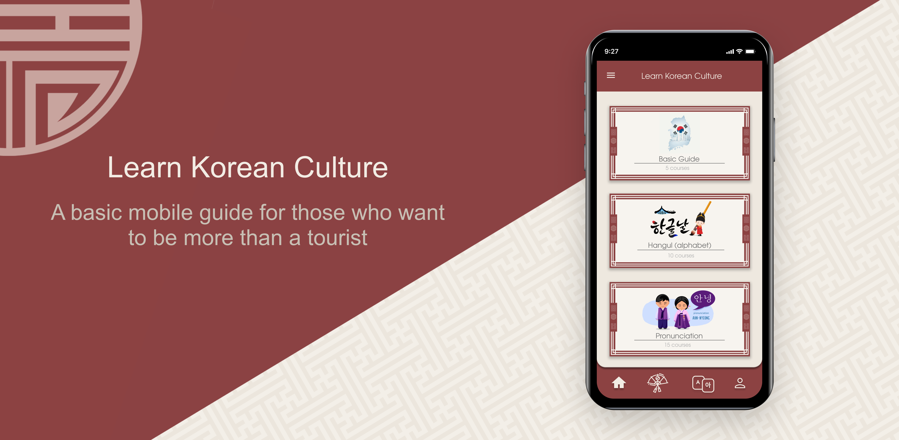

  

<h1 align="center">Learn Korean Culture</h1>

  <em>A beautifully designed mobile app built with Expo + React Native that helps users explore and learn about Korean culture — from food to language, history, and traditions.</em>

---

## 🌟 Overview

**Learn Korean Culture** is an interactive mobile app designed to make cultural learning engaging.  
It blends traditional Korean visuals with a modern app experience, built to demonstrate clean architecture and design in React Native.

---

## 🧠 Features

- 🎨 Beautiful onboarding & welcome screen inspired by Korean design
- 🥢 Explore sections like Points of Interest, Language, and Traditions
- 💬 Interactive flashcards to learn Korean words, expressions, and cultural facts
- 📱 Built with React Native(Expo) for cross-platform performance

---

## 🛠️ Tech Stack

| Category   | Tools                                                                |
| ---------- | -------------------------------------------------------------------- |
| Framework  | [React Native](https://reactnative.dev/) + [Expo](https://expo.dev/) |
| Language   | TypeScript                                                           |
| Styling    | StyleSheet                                                           |
| Navigation | [Expo Router](https://expo.github.io/router/docs)                    |
| Design     | [Figma](https://eleannapili.framer.website/language-learning-app)    |

---

## 🗺️ Roadmap

- [x] Tab navigation
- [x] Welcome screen
- [ ] Home screen
- [ ] Flashcard learning system
- [ ] Progress tracking dashboard
- [ ] User/Account screen
